# FC Furious
 
## Partie Coach

### Commandes élémentaires :
* Commande en position avec une orientation par rapport à un point
* Passe (statique)
* Reception : calcul du vecteur directeur de la balle et ajustement de la position
* Orientation avec la balle : tourner autour de la balle (CIR) pour s'orienter
* Tir

### Postes :
* Shooter : on tire si le but est ouvert
* Dribble : utilisation de l'ia pour dribbler vers une postion où le but ouvert
* Demarquage : utilisation de l'ia pour se demarquer vers une postion où le but ouvert
* Passeur/receveur : réalisation d'une passe statique ou en profondeur avec ajustement du receveur 
* Goal : être entre la balle et le but, devant la surface
* Tackle/Chaser : récupération de la balle 
* Defenseur : plusieurs défenses possibles :  
  * DEF : défense passive dans notre terrain
  * DEF1 : placement entre les 2 attaquants pour empêcher les passes
  * DEF2 : placement entre le 2è attaquant et le but

Dont voici quelques exemples sur simulateur :  

Récuperation de balle avec évitement :  
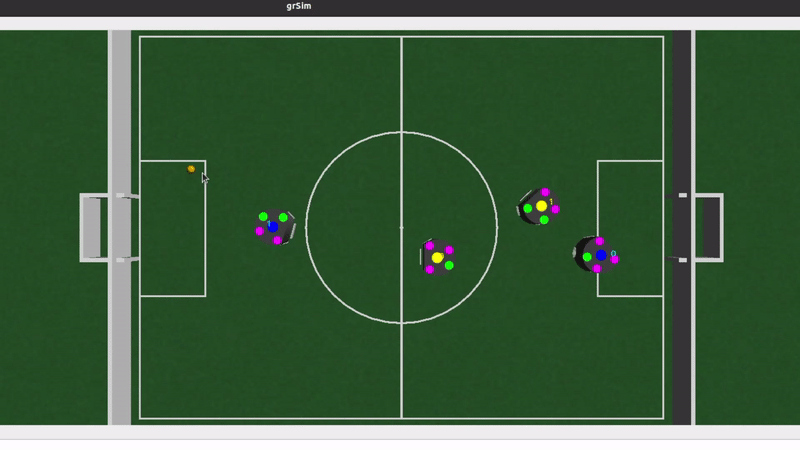 

Passe avec ajustement de la position du receveur puis tir :  
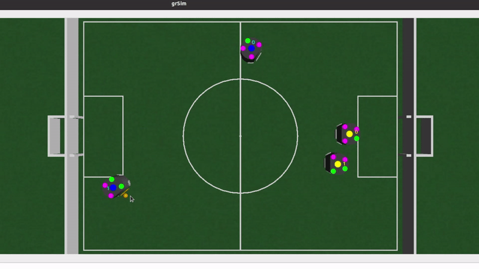 

Dribble de l'attaquant avec la balle pour marquer :  
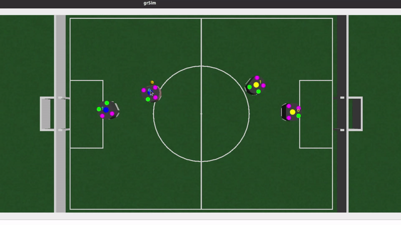  

Démarquage d'un robot avant de recevoir la passe et marquer :  
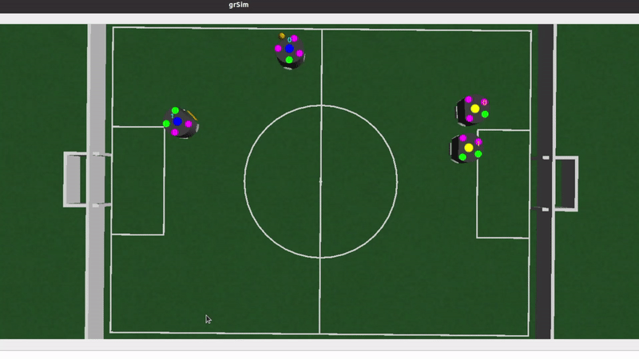 

Défense avec le gardien et un tackle :  
 

### Création d'un champ pour aller à l'objectif en évitant les autres robots :
L'idée de base est de créer un champ répulsif en faisant le gradient de la somme des potentiels, avec un potentiel positif pour les robots à éviter et un potentiel négatif pour l'objectif. Le potentiel étant calculé avec une loi normale :   
P(M)=Pt.e(||M-M0||²/&sigma;²) avec M0 le point d'origine du potentiel  
On peut observer les potentiels :  
  
On obtient un champ de cette forme :
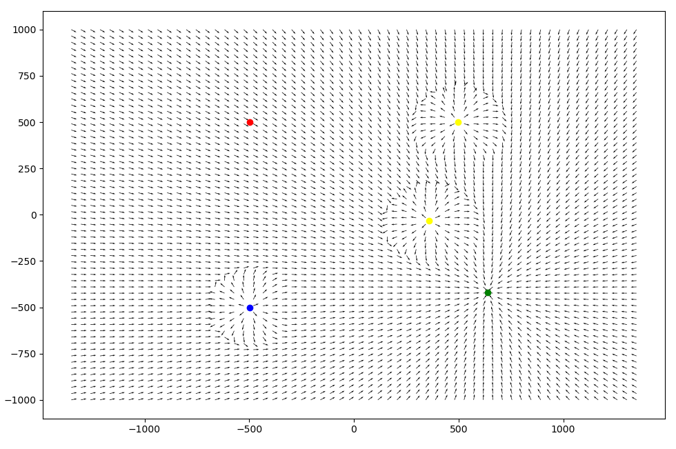  
On voit que le champ répulsif ne permet que d'éviter le robot mais pas de le contourner, de plus il y a des changements brusques de directions.  

On a alors créé un mix d'un champ tournant (rotation de +/-90° du champ répulsif en fonction de la position du robot répulsif) et du champ répulsif Erobot=Etournant+k*Erépulsif avec k=facteur de répulsion.  
De plus, on prend sigma du potentiel pour le champ tournant plus grand donc son effet apparait en premier.  
Ainsi, on obtient :  
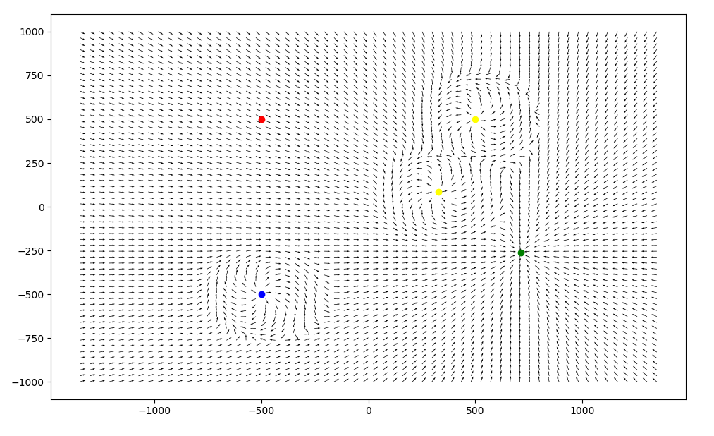  

De plus, on ne  prend pas en compte les robots qui sont derrière succeptible de créer des interférences.

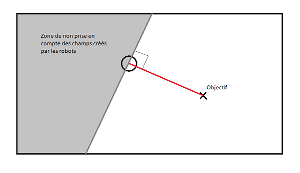  

### Asservissement en position
Ainsi, pour la commande du robot on utilise la direction du vecteur (qui est normé) à la position du robot.  Donc la commande en vitesse est toujours à saturation (env. 0.9 m/s) sauf à partir d´une certaine distance où la distance devient proportionnelle à la distance restante.  

Si on est proche de l'objectif et qu'il y a un robot proche aussi, cela fait des interférences. Dans ce cas, on ne sert plus des champs et on réalise un asservissement classique (proportionnel + saturation) à vitesse réduite.  

### Méthode de visualisation :
Visualisation en direct des positions ainsi que les états des robots, plusieurs solutions : 
* mode -1: aucun affichage
* mode  0: affichage dans la console des changements de postes  
* mode  1: affichage sur un graphique des postes et du status des robots
* mode  2: affichage sur un graphique d'une reproduction du terrain 

### Stratégie:
Pas encore totalement définie.  
Pour le moment, le coach réalise 2 actions:  
* Lecture des données du terrain et attribution des postes 
* Ordre aux robots en fonction de leur poste  

Tout d'abord l´attribution se faisait grâce à un arbre qui testait un certain nombre de conditions. On a remarqué que cette méthode présentait des limites donc on utilise un maintenant un diagramme d´états pour avoir un meilleur contrôle des transitions de poste. Ainsi, on contrôle les transitions beaucoup plus facilement et donc la stratégie est plus efficace. 

Une amélioration possible serait d'adapter la stratégie en fonction du score et du temps restant.  

### Passes  
#### Méthode   
Pour le moment, les passes se font toujours avec le passeur en position statique. Au moment de l'orientation du passeur, on regarde l'angle entre le passeur, le receveur et le but. Si cet angle est inférieur à pi/3 on peut orienter le receveur directement face au but, cela ne posera pas de problème pour la reception et on gagne en rapidité entre la reception de la balle et le tir car le robot est déjà orienté. Sinon on oriente le receveur face au passeur pour la passe.  
De plus, on regarde la passe par rapport au point où le receveur veut se rendre. Ainsi s'il est proche de sa position d'arrivée on peut réaliser une passe appuyée, sinon on réalise une passe en profondeur (donc moins forte) pour laisser le temps au receveur d'arriver à ce point le temps de la passe.

#### Passes en profondeur
##### Caractérisation du kicker  
Recherche d'une relation entre la distance parcourue par la balle et la puissance envoyée au kicker sur le simulateur :  
Sur le simulateur, on a mesuré la distance parcourue pour 20 valeurs de puissances différentes, en répétant la mesure 5x pour observer s'il y avait de la dispersion.  
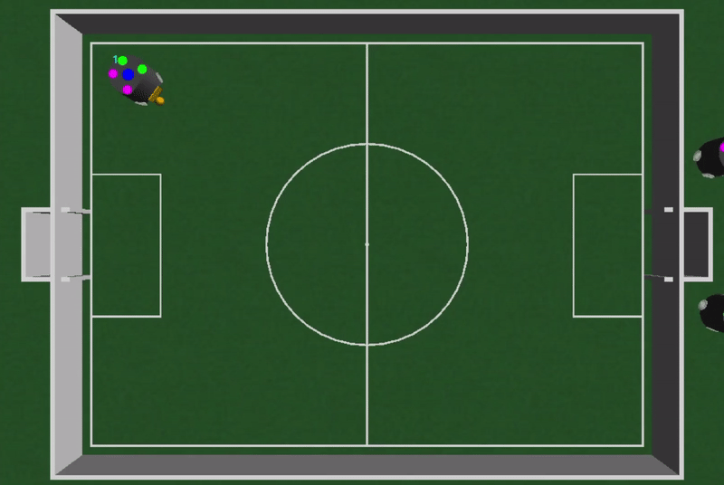   

On a obtenu les points ci-dessous :  
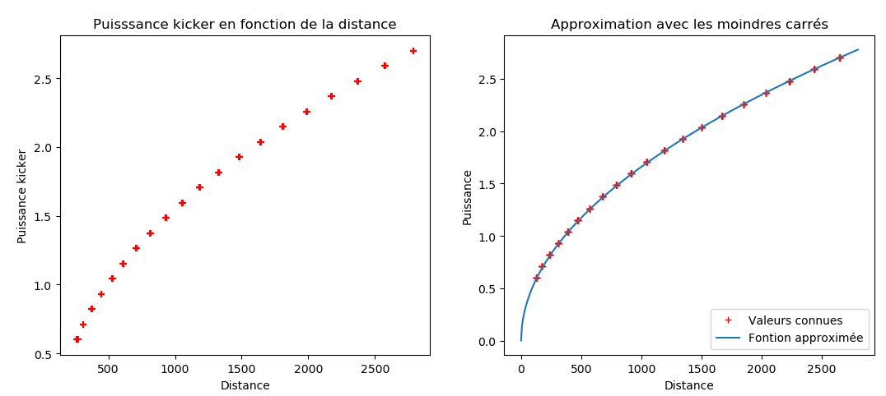 

A gauche, on observe la fonction approximée calculée. Dont voici, la formule :  
Puissance=0.05249286*(distance-140)1/2  

Ainsi, grâce à cette formule, on peut doser précisement les passes en profondeur.

#### Reception   
Lorsque la passe est effectuée, le receveur passe en mode "reception", c'est à dire qu'on adapte sa position en fonction de la trajectoire de la balle pour assurer la reception.

--------------
## Partie intelligence artificielle

### Objectif :
Le but de cette intelligence artificielle est de déplacer un attaquant vers un endroit où le but est ouvert en un minimum de déplacements.

------------
### Agent :
Dans ce cas, on traité un réseau de neurone profond, c'est à dire avec plusieurs couches. On peut le representer sous cette forme :
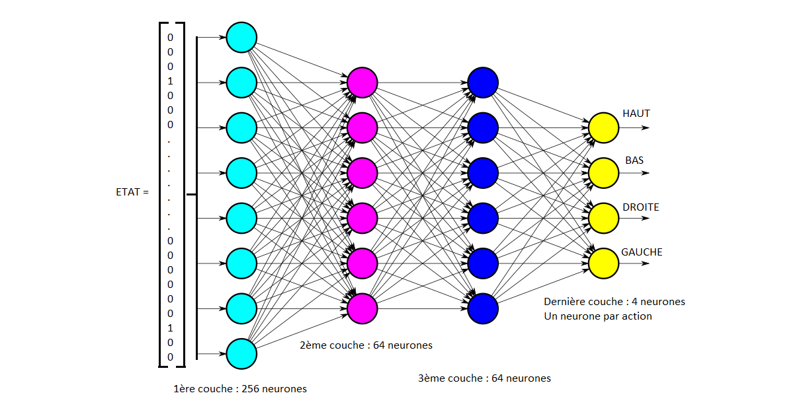
* En entrée, on rentre un état représentatif de la position des robots sous la forme d'un vecteur de dimension 4x9x9.  
* En sortie, on obtient une prédiction pour chacune des actions qui est proportionnelle à la récompense qu'on peut espérer à long terme. On choisit donc l'action pour laquelle l'espérance est la plus grande.  

---
### Entrainement :  
#### Théorie :  
Voici l'algorithme général d'apprentissage dans le cas du deep Q learning :

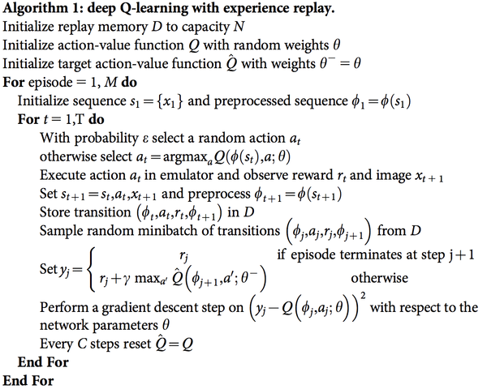 

Il peut être simplifié sous la forme suivante :  

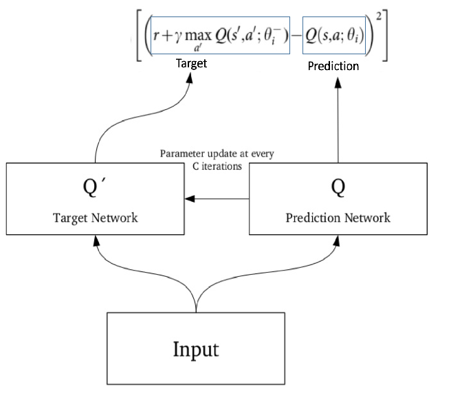  

On calcule une fonction d'erreur *[(r+&gamma;max Q'a'(s',a';&theta;i)) - Q(s,a;&theta;i]²* à partir d'un batch de transitions enregistrées grâce aux 2 réseaux de neurones. L'objectif étant de diminuer cette erreur, on utilise une descente de gradient. Comme ça,on peut espérer converger vers une solution.  

#### Mise en pratique :  
Tout d'abord, il a fallu coder une Classe pour représenter l'environnement dans lequel l'agent va évoluer.  
* Les actions possibles : HAUT, BAS, DROITE, GAUCHE
* Le terrain avec ses limites
* L'objectif pour finir une partie : but ouvert
* Les récompenses :   
  * -1 par déplacement effectué pour forcer l'agent à trouver le plus court chemin
  * -3 s'il sort du terrain ou s'il se prend un autre robot (la valeur étant plus élévé, l'agent devrait éviter les robots plus facilement)
  * +10 si l'objectif est accompli  
  
Ensuite, il a fallu coder une Classe pour l'agent grâce à la bibliothèque TensorFlow avec :
* Les deux réseaux de neurone Q et Q' (noté q_network et target_network dans le code)
* Une fonction qui choisit la meilleure action
* Les fonctions nécéssaires pour entrainer l'agent

Après de nombreux tests, modifications du programme d'entrainement etc.. Voici les résultats du meilleur entrainement (pour 10000 parties jouées) :
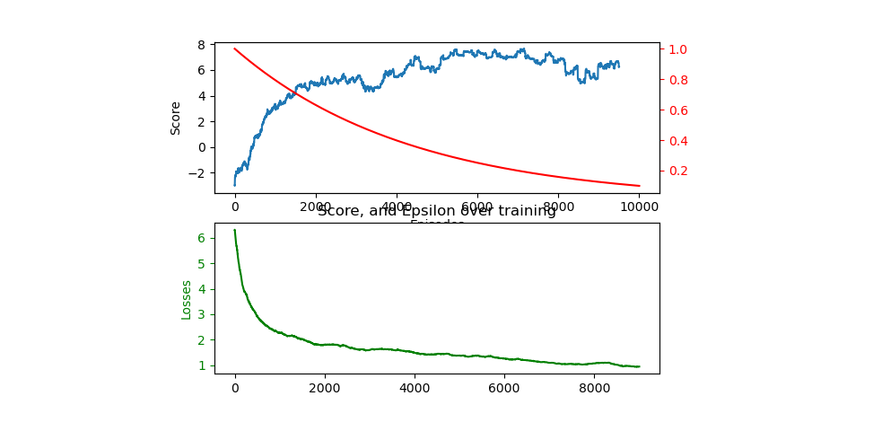

On observe effectivement que la fonction Loss function *[(r+&gamma;max Q'a'(s',a';&theta;i)) - Q(s,a;&theta;i]²* diminue bien sur le graphique du bas.  
De plus, le score des parties augmentent jusqu'à atteindre quasiment 8, cela correspond à atteindre l'objectif en 3 mouvements seulement. C'est très bon, l'algorithme d'entrainement est efficace et on a obtenu un bon agent.

Exemple de génération de partie :  
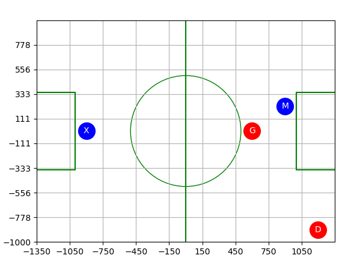
* X représentant l'attaquant qui veut marquer, c'est lui qui est controlé par notre agent.
* M représentant son coéquipier.
* G représentant le gardien
* D représentant le 2ème defenseur.

Sur cette situation, on obtient au final cette position pour l'attaquant :
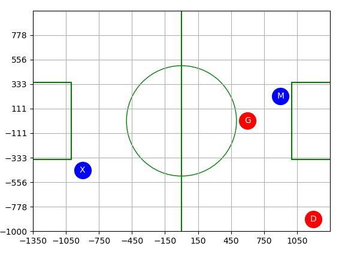  
* Mouvements : 2  
* Score : 9

De même, on obtient ce résultat :  
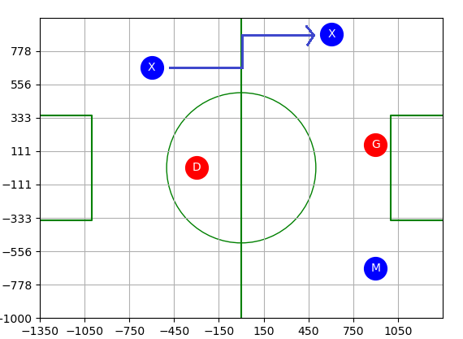  
* Mouvements : 5  
* Score : 6  

La génération étant aléatoire pour couvrir toutes les configurations de terrains possibles, parfois l'issue est très simple (1 mouvement suffit), d'autres fois elle l'est beaucoup moins.  
Animation :  
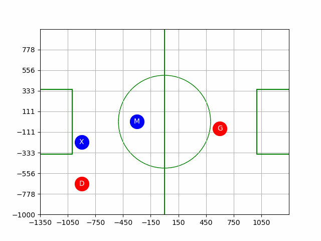

---
### Validation de l'agent obtenu :
Après plusieurs séries de tests sur 10000 générations de parties aléatoires. Le score moyen est de 8.6 avec un taux d'échec inférieur à 0.6%. Un échec est comptabilisé si l'agent n'atteint pas l'objectif en moins de 20 coups.  
Les résultats sont très satisfaisants et donc utilisables pour le coach.   
De plus le temps d'execution de 10000 parties est seulement d'une trentaine de seconde donc assez rapide pour être implémenté. (Sur ma machine)

---
### Implémentation dans le code du coach :
Cette ia intervient lorsque un des attaquants n'a pas le but libre devant lui. Dans ce cas, on fait appel à cette ia qui calcule la position finale et le score pour s'ouvrir le chemin du but. Ainsi, on peut commander le robot vers cette position.  
La limite de cette ia c'est qu'elle ne prend pas en compte les déplacements des joueurs et donc la solution ne menera pas toujours à un but.    
On verra par la suite comment l'utiliser :
* Prédiction de la position finale
* Prédiction des déplacements un par un pour ainsi actualiser l'état du terrain entre deux déplacements.

---
### Améliorations :  
En mettant en place l'ia dans le coach, on remarque que la solution est souvent assez loin du but, ce qui est donc pas très éfficace pour marquer. Pour remedier à ce problème, une contrainte a été rajouté pour l'objectif. En effet maintenant le robot doit être dans la moitié de terrain adverse pour satisfaire l'objectif. Ainsi on observe que l'ia est beaucoup plus offensive et donc plus efficace sur le simulateur.

----
### Agent pour se démarquer  
Modification du modèle pour créér un agent pour se démarquer. 
#### Objectif  
En partant d'une situation où le porteur de balle ne peut pas marquer et que la passe est impossible, on veut bouger le teammate vers une zone avec le but ouvert et la passe possible.

#### Entraînement 
Mise en place identique que précédemment, modification uniquement des règles et récompenses de l'environnement.  
Cette fois ci, l'entraînement est beaucoup plus important, il fallu réaliser un plus grand d'épisodes pour converger vers une solution, en effet il a plus de contraintes.
